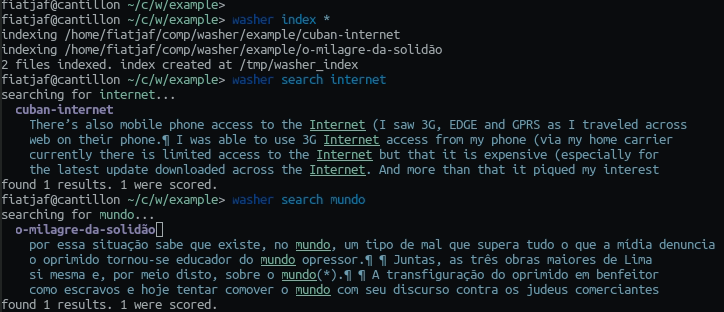

fiatjaf@cantillon ~/c/w/example> washer index *
indexing /home/fiatjaf/comp/washer/example/cuban-internet
indexing /home/fiatjaf/comp/washer/example/o-milagre-da-solidão
2 files indexed. index created at /tmp/washer_index
fiatjaf@cantillon ~/c/w/example> washer search internet
searching for internet...
  cuban-internet
    There’s also mobile phone access to the Internet (I saw 3G, EDGE and GPRS as I traveled across
    web on their phone.¶ I was able to use 3G Internet access from my phone (via my home carrier
    currently there is limited access to the Internet but that it is expensive (especially for
    the latest update downloaded across the Internet. And more than that it piqued my interest
found 1 results. 1 were scored.
fiatjaf@cantillon ~/c/w/example> washer search mundo
searching for mundo...
  o-milagre-da-solidão
    por essa situação sabe que existe, no mundo, um tipo de mal que supera tudo o que a mídia denuncia
    o oprimido tornou-se educador do mundo opressor.¶ ¶ Juntas, as três obras maiores de Lima
    si mesma e, por meio disto, sobre o mundo(*).¶ ¶ A transfiguração do oprimido em benfeitor
    como escravos e hoje tentar comover o mundo com seu discurso contra os judeus comerciantes
found 1 results. 1 were scored.

